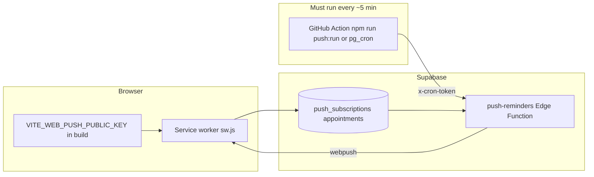

# End-to-end testing plan (blank account)

Use this as a **single ordered pass** or as **sections** you repeat after env changes. Paths come from [`src/App.tsx`](../src/App.tsx) and the [route map in README](../README.md).

---

## 0. Preconditions (once per environment)

- **Same Supabase project everywhere:** Production host `VITE_SUPABASE_URL` + `VITE_SUPABASE_ANON_KEY` match the project where you ran migrations ([README](../README.md) “Before inviting testers”).
- **Migrations applied:** `supabase/migrations/*.sql` on that project (tables like `push_subscriptions`, storage buckets, RLS). If schema is behind, features fail in confusing ways.
- **Secure context for push:** HTTPS or `localhost` ([README](../README.md) service worker note).
- **Edge functions + secrets:** Deployed when you use those features; optional features need keys documented in README / DEVELOPERS.

---

## 1. Account and session

1. Open `/login`, create or sign in with the **blank test account**.
2. Confirm redirect to `/app` (dashboard).
3. Sign out and sign back in once (session stability).

**Interconnect:** Auth gates all `/app/*` routes ([`Protected` in App.tsx](../src/App.tsx)).

---

## 2. Profile and account basics (`/app/profile`)

1. **Display name / email** (if exposed): save and refresh.
2. **Password / email flows** (Profile actions): only if you use them; confirm banners or email behavior.
3. **Weather / location prefs** (if present): set and reload page.
4. **Avatar upload** (if you use it): depends on `profile-icons` storage migration—confirm image appears after save.
5. **Data export** (JSON/PDF from profile): run once; confirms RLS + client export path.

**Interconnect:** Profile is the hub for **push**, **export**, and **avatar**; failures here often mean env or storage policies.

---

## 3. Core logging and dashboard (`/app`, `/app/log`)

1. **Dashboard** (`/app`): load without errors; note any summary/handoff UI (mostly client-side narrative per codebase).
2. **Quick log** (`/app/log`): add at least one **pain** and one **symptom/MCAS** entry (or whatever your schema expects).
3. Return to **dashboard**: confirm new data surfaces (charts, summaries, or lists as designed).

**Interconnect:** Daily push nudge logic checks **same-day** `pain_entries` and `mcas_symptom_logs` ([`push-reminders/index.ts`](../supabase/functions/push-reminders/index.ts)); logging here affects whether a “daily nudge” can ever fire (see section 8).

---

## 4. Medications, doctors, diagnoses, tests

| Path | What to verify |
|------|----------------|
| `/app/meds` | Add/edit med; appears in lists and anywhere dashboard references meds. |
| `/app/doctors` + `/app/doctors/:id` | Create doctor; open profile. |
| `/app/diagnoses` | Add directory entries; used in narrative/summary context. |
| `/app/tests` | Add ordered tests; links to visit flow if applicable. |

**Interconnect:** Doctors/diagnoses/meds feed **dashboard handoff** and **visit** flows.

---

## 5. Appointments, questions, visits (cross-feature)

1. **`/app/appointments`:** Create an appointment **today or tomorrow** with a time and doctor name matching your other data.
2. **`/app/questions`:** Add **open** questions tied to that doctor/date (or flow your UI requires).
3. **`/app/visits`:** Create or complete a visit; set **pending** vs done as your app allows.

**Interconnect:** Push **pre-appointment** and **post-appointment** reminders query `appointments`, `doctor_questions`, `doctor_visits` ([`processSubscription`](../supabase/functions/push-reminders/index.ts)). Wrong dates or already-completed conditions = no pushes even when “enabled.”

---

## 6. Records and analytics

1. **`/app/charts-trends` or `/app/records`:** Data from logging appears.
2. **`/app/analytics`:** Loads with your test data.

**Interconnect:** Same underlying tables as logging; validates aggregation paths.

---

## 7. Transcripts and AI (Edge Functions)

1. **`/app/transcripts`** and **`/app/solo-record`:** Start transcription flows that call **`transcribe-visit`** and (where applicable) **`generate-summary`** via `supabase.functions.invoke` ([`VisitTranscriber.tsx`](../src/components/VisitTranscriber.tsx), [`SoloTranscriber.tsx`](../src/components/SoloTranscriber.tsx), [`transcriptExtract.ts`](../src/lib/transcriptExtract.ts)).

2. Confirm: no errors about missing **`ASSEMBLYAI_API_KEY`** / **`ANTHROPIC_API_KEY`** in function logs when you expect AI paths.

**Interconnect:** Requires **signed-in user** + deployed functions + secrets; independent of web push.

---

## 8. Web push (deep dive — why “enabled” can still mean zero notifications)

“Enabled” in the Profile UI means: browser **push subscription exists**, row in **`push_subscriptions`**, and toggles saved ([`ProfilePage.tsx`](../src/pages/ProfilePage.tsx), [`pushNotifications.ts`](../src/lib/pushNotifications.ts)). It does **not** guarantee notifications on a schedule.

**Checklist (in order):**

1. **Build:** `VITE_WEB_PUSH_PUBLIC_KEY` in the **deployed** frontend bundle matches **`WEB_PUSH_VAPID_PUBLIC_KEY`** in Edge (same string as README).
2. **Browser:** OS “Do not disturb” / site notification permission **allowed** for that origin (not just “enabled” in app).
3. **Scheduler:** Something must **POST** to `.../functions/v1/push-reminders` about every **5 minutes** with header **`x-cron-token`** equal to **`PUSH_REMINDER_CRON_TOKEN`** ([`run-push-reminders.mjs`](../scripts/run-push-reminders.mjs), [`.github/workflows/push-reminders.yml`](../.github/workflows/push-reminders.yml)). If nothing calls the function, **no pushes ever**.
4. **Timing:** The function only sends when **current time** is within **±5 minutes** of:
   - **1 hour before** appointment (pre-appt), and only if you have **no** `doctor_questions` for that doctor/date yet ([push-reminders pre-appt logic](../supabase/functions/push-reminders/index.ts));
   - **1 hour after** appointment (post-appt), only if follow-up conditions match (same file);
   - **Daily nudge** at your chosen **local** time, only if **no** pain or symptom logs **that calendar day** (same file).

**Practical test:** After confirming (1)–(3), manually run **`npm run push:run`** (or invoke the function with the cron token) **at the exact window** you engineered (e.g. set daily nudge time to **two minutes from now**, add **no** logs today, then trigger when the clock hits the window). Check Supabase **Edge Function logs** for `push-reminders` on failure.

See also: [web-push-what-already-exists.md](./web-push-what-already-exists.md).

---

## 9. Optional: Plushies / game tokens

- Only if **`VITE_GAME_TOKENS_ENABLED=true`** ([`gameTokens.ts`](../src/lib/gameTokens.ts)).
- Routes `/app/plushies` and `/app/plushies/mine` otherwise redirect to `/app`.

**Interconnect:** Requires plushie-related migrations and RPCs per README.

---

## 10. Navigation and resilience

- **More** (`/app/more`): links to secondary areas.
- **404:** `/app/unknown-route` hits [`NotFoundPage`](../src/pages/NotFoundPage.tsx).

---

## Suggested order for a “full day”

Morning: **1 → 2 → 3 → 4**. Midday: **5 → 6**. Afternoon: **7 → 8** (push last, after data exists). Evening: **9** if enabled, **10** quick pass.

---

## Notification troubleshooting (summary)

Most common causes in **this** codebase: **(a)** cron never invoked; **(b)** VAPID public key mismatch between build and Edge; **(c)** not inside the **5-minute** send window; **(d)** appointment/daily nudge **business rules** not satisfied (e.g. already added questions, already logged today); **(e)** OS/browser blocking notifications. Work through section **8** top to bottom before changing keys.
